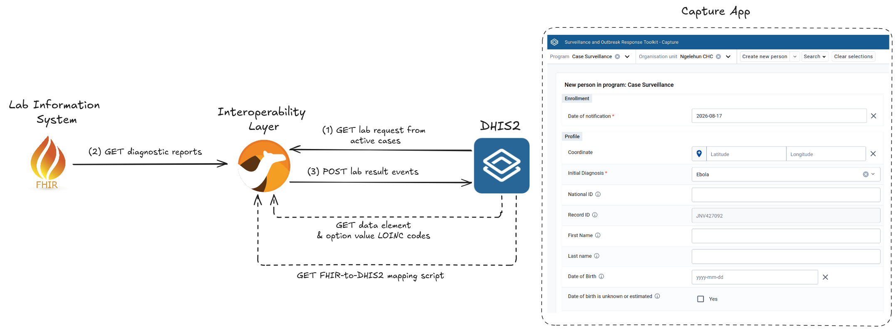
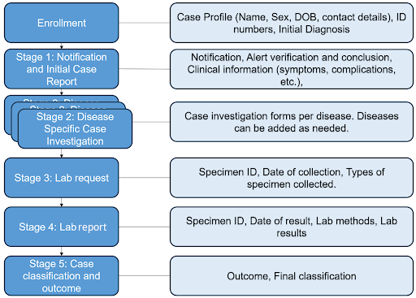
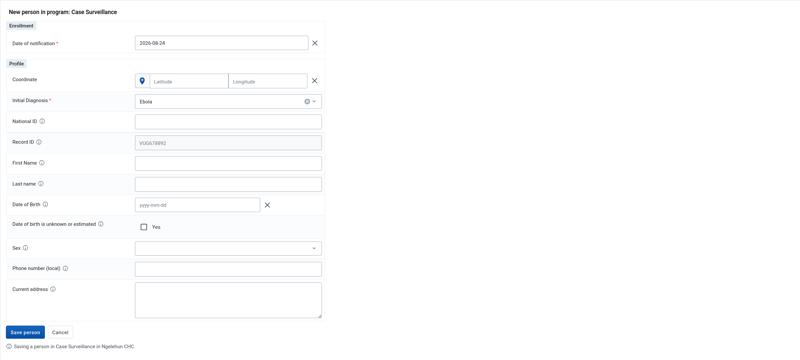
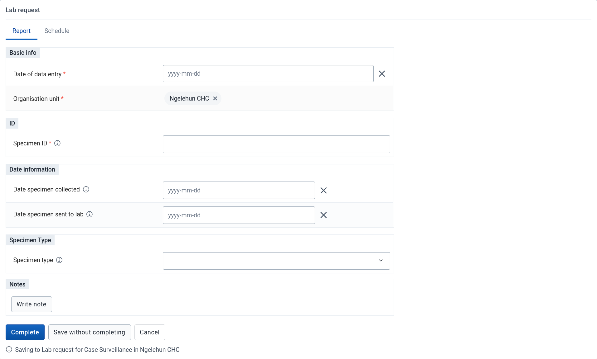
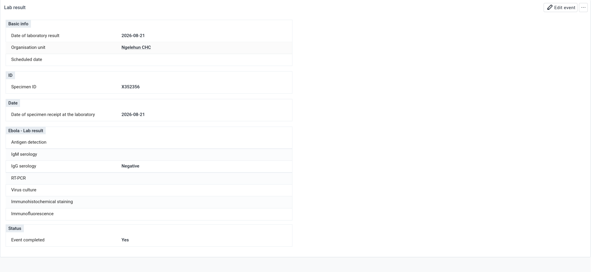
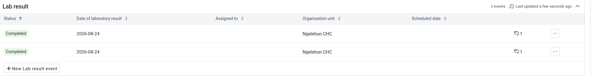
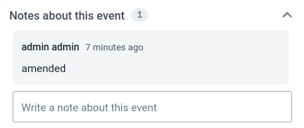
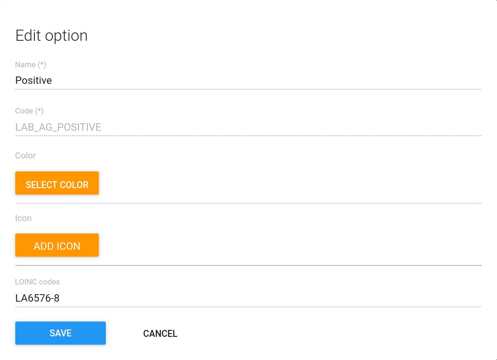

# DHIS2 Tracker Lab Result Integration - reference implementation [DRAFT]

[ToC TODO]

## What is this implementation?

DHIS2 Tracker programmes can be configured to support case-based disease surveillance and EMR functions such as patient health record. Often laboratory results need to be entered into such programmes to inform the decision-making of health professionals. In contrast to manual data entry, sending electronically the laboratory results to DHIS2 helps speed up this decision-making, eliminate manual transcribing errors between systems, as well as improve the information availability to all health and management staff. 

A Laboratory Information System (LIS) is typically the primary source of laboratory results destined to other information systems. With the generous support of US CDC, HISP Centre developed this reference implementation to demonstrate the electronic transmission of lab results from a LIS to DHIS2, improving the timeliness and quality of such results in Tracker programmes.

As defined in [Laboratory Information Systems Project Management: A Guidebook for International Implementations](https://aphl.org/docs/default-source/technical/gh-2019may-lis-guidebook-web.pdf), a LIS is a _computer-based information management systems created specifically for laboratories, to support workflow, track data from the start to the end of the testing process, store data, and provide correct and complete information to laboratory staff, managers, and customers in a timely manner allowing for decision making by clinicians, epidemiologists and other stakeholders_.

This reference implementation imports the laboratory results from a LIS into a DHIS2 Tracker programme used for case-based disease surveillance. The import is accomplished by (1) fetching laboratory diagnostic reports from a mock LIS conforming to the [HL7 Laboratory FHIR Implementation Guide](https://build.fhir.org/ig/HL7/uv-lab-rep-ig/), (2) transforming them into Tracker events, and then (3) transmitting the events to the [DHIS2 Web API](https://docs.dhis2.org/en/develop/using-the-api/dhis-core-version-master/introduction.html). The data exchange between the health information systems is mediated thanks to a DHIS2-driven interoperability layer component which also bridges the structural and semantic differences between FHIR and DHIS2.

This is an example meant to technically guide you in developing your own integration between an LIS and DHIS2. It **SHOULD NOT** be used directly in production without adapting it to your local context.

## Quick Start

1. From the machine where you intend to run the reference implementation:
   1. [Install Docker Desktop](https://docs.docker.com/desktop/) which provides the tooling required to bring up the sandbox environment
   2. [Install the Git client](https://git-scm.com/book/en/v2/Getting-Started-Installing-Git) and then run the command shown next to download the reference implementation repository: `git clone https://github.com/dhis2/reference-dhis2-tracker-lis-integration.git`
   3. [Install the Bruno script runner](https://docs.usebruno.com/bru-cli/installation) for simulating the laboratory analyser that sends the diagnostic results to the LIS
2. Within a terminal, change the current directory to `reference-dhis2-tracker-lab-result-integration` and run `docker compose up --wait --remove-orphans`. Wait until the command completes before moving on to the next step. This command will stand up:
   * DHIS2 which is reachable from `http://localhost:8080/`
   * a mock LIS which is reachable from `http://localhost:8081/`
   * the interoperability layer running as a background process
3. From your browser, type the following in the address bar to open the enrollment form for the case surveillance program: http://localhost:8080/apps/capture#/new?orgUnitId=DiszpKrYNg8&programId=N07iEegH3Hw. Alternatively, follow these steps:
   1. Open the Capture app from the DHIS2 dashboard in your local DHIS2 instance on `http://localhost:8080/`
   2. Expand the _Program_ drop-down box and pick _Case Surveillance_ 
   3. Expand the _Organisation unit_ down-down box and type _Ngelehun CHC_ before proceeding to select it
   4. Press the _Create new person_ button
4. In the enrollment form, expand the _Initial Diagnosis_ drop-down box and pick `Ebola`
5. Press the _Save person_ button, located at the bottom of the form
6. From the enrollment dashboard, click on _New Lab request event_
   1. Choose a date from the _Date of data entry_ date picker
   2. Insert a random identifier like `123456` in the _Specimen ID_ field (the specimen ID must always be unique across all lab request events)
   3. Press the `Complete` button, located at bottom of the form
7. From a terminal, change the current directory to `reference-dhis2-tracker-lab-result-integration/tests/create-fake-lab-diagnostic-report-collection` and launch `bru run` to simulate the laboratory analyser. Wait until the command completes before moving on to the next step.
8. Wait at least a minute before refreshing the DHIS2 enrollment dashboard in order to give time for the LIS laboratory result to be synced with DHIS2. After the refresh, an event should appear under the _Lab result_ section of the enrollment dashboard but try refreshing the page a couple of more times if the event does not show up.
9. Open the lab result event to view the laboratory diagnosis confirming or refuting the initial Ebola diagnosis.

## Overview

The subsequent diagram conceptualises the architecture of this reference implementation:

What follows is a brief overview of the architectural components:

### DHIS2

The role assigned to DHIS2 in this reference implementation is that of an [integrated surveillance and outbreak response system](https://dhis2.org/events/africa-cdc-toolkit-ebola/). The DHIS2 instance is preconfigured with programs covering case surveillance and contract tracing. The lab result integration is focused on the case surveillance program which has its workflow depicted below:

The following sections drill down into the stages that are relevant to the lab result integration.

#### Enrollment Stage

A disease surveillance case in DHIS2 starts with enrollment of a person having a suspect disease. The surveillance officer needs to select the initial diagnosis before they can enroll the person into the programme. In the enrollment form shown below, the initial diagnosis can be either cholera, ebola, or mpox.

#### Lab Request Stage

The lab request stage is used for reporting the laboratory order and to link the LIS laboratory result to the surveillance case. The link is established thanks to the specimen ID which is entered into this stage's data entry form shown next:

The specimen ID field shown above is mandatory and is expected to be unique for each lab request, even across cases. In other settings, instead of the specimen ID, alternative or additional unique linking identifiers could be required such as the patient name or the case ID, each with their own tradeoffs.

Completing the lab request form does not trigger a laboratory order. It is assumed that the laboratory test itself is ordered at a prior point in the overall disease surveillance workflow (e.g., during initial clinical diagnosis). However, to facilitate testing and demoing, accompanying the reference implementation is a test kit that fetches the completed lab requests of in-progress cases from DHIS2, generates corresponding laboratory lab reports, and pushes the reports to the LIS.

#### Lab Result Stage

Following the lab request is the lab result program stage. This is the stage that has its form auto-populated with the results from the LIS through the Interoperability Layer as described in the next section. Without human intervention, a lab result is imported into the ongoing case when a laboratory report that has a specimen ID linking it to the lab request in DHIS2 becomes available in the LIS. The outcome is a completed lab result data entry form like the following:

There can be multiple lab results for a given lab request as shown next:

The successive lab results represent corrections or amendments in the LIS diagnostic report. The individual lab result shows its status change in the event notes section like what is presented here:

---

As part of the lab result integration, DHIS2 drives the transformation and terminology mapping such that the lab result can be imported into DHIS2. In terms of FHIR-to-DHIS2 JSON transformation, the DHIS2 data store holds the [DataSonnet](https://datasonnet.github.io/datasonnet-mapper/datasonnet/latest/index.html) script translating the FHIR resources into DHIS2 resources:

[TODO]

In terms of terminology mapping, DHIS2 binds the data elements and option set values to lab terminology via attributes. For example, the following option set value config maps either the LOINC code `LA11882-0` or `LA6576-8` to the option set value `POSITIVE`. 

The DHIS2 implementer benefits from having the transformation of the lab result driven by DHIS2. Such separation of logic permits the implementer to revise the LOINC-to-DHIS2 code mappings within DHIS2 without needing to enlist the technical team maintaining the IOL. Taking this one step further, an implementer proficient in DataSonnet and the DHIS2 Web API could adjust the transformation script in the DHIS2 data store caused by changes in the lab result program stage or the LIS.

### Lab Information System

The LIS is the source of the lab results in the DHIS2 case surveillance programme. In the real world, one or more laboratory analysers would run tests on the specimen and then report their results to the LIS for storage and analysis. However, in this reference implementation, a script runner is used instead to fake the results and transmit them to a mock LIS. These results are in turn read by the Interoperability Layer as described in the next section.

HAPI FHIR is the server powering the mock LIS. FHIR (Fast Healthcare Interoperability Resources) is a modern, adaptable health data exchange standard that allows us to keep the integration decoupled from any particular LIS interface. HAPI FHIR is a popular open-source server implementation of FHIR and is configured to conform to the [universal Laboratory Report Implementation Guide](https://build.fhir.org/ig/HL7/uv-lab-rep-ig/). At the time of writing, the guide is still in draft stage, nevertheless, it was selected to represent the lab result communication due to its broad scope thanks to the participation of experts from several countries, projects, and initiatives. 

The IG profiles several FHIR resources though the following are used in this project:

* Specimen: holds the specimen ID and the date the specimen was received at the lab
* Observation: contains the LOINC codes identifying the test carried out and its result
* Patient: the test subject which can be anonymous so to safeguard patient data
* DiagnosticReport: bundles together the specimen, observation, and patient resources while provides a status 

### Interoperability Layer

The interoperability layer (IOL) is a low-code and customisable [Apache Camel](https://camel.apache.org/) background application running on the Java Virtual Machine (JVM) that bridges the LIS diagnostic report to the DHIS2 lab result program stage. Its operation is broadly broken down in the following steps:

1. The application routinely fetches active enrollments in the program having the ID `N07iEegH3Hw` (i.e., case surveillance program) from DHIS2 with the subsequent HTTP call: `.../api/tracker/enrollments?program=N07iEegH3Hw&status=ACTIVE&fields=enrollment,events`.

2. If there are active cases, the IOL proceeds to:

   1. Fetch from DHIS2:
      1. data element codes that have LOINC code attributes present using the HTTP call `.../api/dataElements?LqVVfNVy594:!null&fields=code,attributeValues`
      2. option set value codes have LOINC code attributes present using the HTTP call `.../api/options?LqVVfNVy594:!null&fields=code,attributeValues`
      3. the DataSonnet script from the data store using the HTTP call `.../api/dataStore/iol/diagnosticReportTranformScript`

   2. Search for completed lab requests within the downloaded active cases such that the event program stage ID is equal to `N07iEegH3Hw` and the status is equal to `COMPLETED`. 

   3. Extract the specimen ID from each lab request and collect into a list any lab results matching the lab request specimen ID. 

   4. Record the `createdAt` timestamp of the most recent lab result should there be one or more corresponding lab results. This timestamp allows the IOL to fetch the LIS diagnostic report after the `createdAt` of the most recent lab result.

   5. Fetch the diagnostic report from the LIS for a given lab request with the HTTP call `/DiagnosticReport?status=final,amended,appended,corrected&specimen.accession=[specimenId]&_include=DiagnosticReport:result&_include=DiagnosticReport:specimen&_lastUpdated=gt[lastLabResultCreatedAt]` where:
      * `[specimenId]` is substituted with the lab request specimen ID, and 
      * `[lastLabResultCreatedAt]` is substituted with the `createdAt` of the most recent lab result for `[specimenId]`. `[lastLabResultCreatedAt]` defaults to `0000-01-01` if no such lab result exists to indicate that the diagnostic report should be retrieved regardless

   6. Transform the diagnostic report, if returned, into a DHIS2 event using the DataSonnet script fetched in step _2ia_ and where the LOINC codes are mapped into data element and option set value codes using mapping downloaded from step _2ib_ and _2ic_

   7. Import the event into DHIS2 with an HTTP POST sent the endpoint `.../api/tracker?async=false` where the `async` query parameter is set to `false` in order to import the event synchronously.

The IOL is configured through one or more YAML files. The subsequent table lists the parameters that can be configured in the IOL:

|           **Parameter Name**            | **Description**                                                                           |
|:---------------------------------------:|:------------------------------------------------------------------------------------------|
|              dhis2.api.url              | Web API base path of the DHIS2 server                                                     |
|           dhis2.api.username            | Username of the DHIS2 Web API user. Required when not using PAT authentication            |
|           dhis2.api.password            | Password of the DHIS2 Web API user. Required when not using PAT authentication            |
|              dhis2.api.pat              | PAT of the DHIS2 server Web API user. Required when not using basic access authentication |
|         dhis2.api.readTimeoutMs         | TODO                                                                                      |
|      dhis2.loincCodesAttribute.id       | TODO                                                                                      |
|            dhis2.program.id             | TODO                                                                                      |
|  dhis2.program.specimenDataElement.id   | TODO                                                                                      |
| dhis2.program.labRequestProgramStage.id | TODO                                                                                      |
| dhis2.program.labResultProgramStage.id  | TODO                                                                                      |
|               lis.api.url               | TODO                                                                                      |

## Privacy Considerations

TODO

## Security Considerations

TODO

## Performance Considerations

TODO

