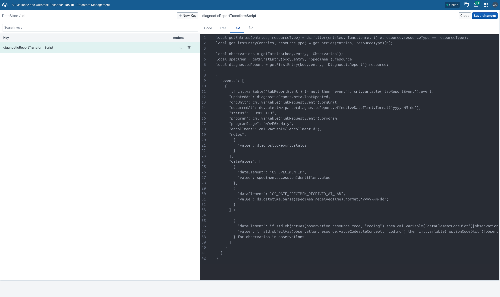

# DHIS2 Tracker Lab Result Integration - reference implementation [DRAFT]

[ToC TODO]

## What is this implementation?

DHIS2 Tracker programs can be configured to support case-based disease surveillance and EMR functions such as patient health record. Often laboratory results need to be entered into such programs to inform the decision-making of health professionals. In contrast to manual data entry, sending electronically the laboratory results to DHIS2 helps speed up this decision-making, eliminate manual transcribing errors between systems, as well as improve the information availability to all health and management staff. 

A Laboratory Information System (LIS) is typically the primary source of laboratory results destined to other information systems. With the generous support of the [U.S. Centers for Disease Control and Prevention](https://www.cdc.gov), HISP Centre developed this reference implementation to demonstrate the electronic transmission of lab results from a LIS to DHIS2, improving the timeliness and quality of such results in Tracker programs.

As defined in [Laboratory Information Systems Project Management: A Guidebook for International Implementations](https://aphl.org/docs/default-source/technical/gh-2019may-lis-guidebook-web.pdf), a LIS is a _computer-based information management systems created specifically for laboratories, to support workflow, track data from the start to the end of the testing process, store data, and provide correct and complete information to laboratory staff, managers, and customers in a timely manner allowing for decision making by clinicians, epidemiologists and other stakeholders_.

This reference implementation imports the laboratory results from a LIS into a DHIS2 Tracker program used for case-based disease surveillance. The import is accomplished by (1) fetching laboratory diagnostic reports from a mock LIS conforming to the [HL7 Laboratory FHIR Implementation Guide](https://build.fhir.org/ig/HL7/uv-lab-rep-ig/), (2) transforming the diagnostic reports into Tracker events, and then (3) transmitting the events to the [DHIS2 Web API](https://docs.dhis2.org/en/develop/using-the-api/dhis-core-version-master/introduction.html). The data exchange between the health information systems is mediated thanks to a DHIS2-driven Interoperability Layer (IOL) component which also bridges the structural and semantic differences between the FHIR and DHIS2 resources.

This is a working example meant to technically guide you in developing your own integration between an LIS and DHIS2. It **SHOULD NOT** be used directly in production without adapting it to your local context. Prior to studying the software artefact, it is important to read the [implementation guidance on lab interoperability](https://docs.dhis2.org/en/implement/integration-reference-implementations/laboratory-interoperability.html).

## Quick Start

1. From the machine where you intend to run the reference implementation:
   1. [Install Node](https://nodejs.org/en/download) so that you can run Yarn
   2. [Install Yarn](https://yarnpkg.com/getting-started/install) to facilitate the building and running of the project
   3. [Install Docker Desktop](https://docs.docker.com/desktop/) which provides the tooling required to bring up the sandbox environment
   4. [Install the Git client](https://git-scm.com/book/en/v2/Getting-Started-Installing-Git) which is a source code management tool
   5. [Install the Bruno script runner](https://docs.usebruno.com/bru-cli/installation) to simulate the laboratory instrument that sends the diagnostic results to the LIS
2. Within a terminal, run the command shown next to download the reference implementation repository: `git clone https://github.com/dhis2/reference-dhis2-tracker-lab-result-integration.git`
3. Change the current directory in your terminal to `reference-dhis2-tracker-lab-result-integration` and run:
   ```sh
   yarn install --frozen-lockfile
   yarn build
   yarn start
   ```
   Running these commands will:
   * Install the test development dependencies
   * Build the IOL application
   * Stand-up the components which include: 
     * DHIS2 which is reachable from `http://localhost:8080/`
     * a mock LIS which is reachable from `http://localhost:8081/`
     * the IOL running as a background process
4. From your browser, type the following in the address bar to open the enrollment form for the case surveillance program: http://localhost:8080/apps/capture#/new?orgUnitId=DiszpKrYNg8&programId=N07iEegH3Hw. Alternatively, follow these steps:
   1. Open the Capture app from the DHIS2 dashboard in your local DHIS2 instance on `http://localhost:8080/`
   2. Expand the _Program_ drop-down box and pick _Case Surveillance_ 
   3. Expand the _Organisation unit_ down-down box and type _Ngelehun CHC_ before proceeding to select it
   4. Press the _Create new person_ button
5. In the enrollment form, expand the _Initial Diagnosis_ drop-down box and pick `Ebola`
6. Press the _Save person_ button, located at the bottom of the form
7. From the enrollment dashboard, click on _New Lab request event_
   1. Choose a date from the _Date of data entry_ date picker
   2. Insert a random identifier like `123456` in the _Specimen ID_ field (the specimen ID must always be unique across all lab request events)
   3. Press the `Complete` button, located at bottom of the formsemantic
8. From a terminal, change the current directory to `reference-dhis2-tracker-lab-result-integration/tests/create-fake-lab-diagnostic-report-collection` and launch `bru run fetch-lab-requests-from-dhis2.yml` to simulate the laboratory instrument. Wait until the command completes before moving on to the next step.
9. Wait at least a minute or two before refreshing the DHIS2 enrollment dashboard in order to give time for the LIS laboratory report to be imported into DHIS2. After the refresh, an event should appear under the _Lab report_ section of the enrollment dashboard. Try refreshing the page a couple of more times if the event does not show up.
10. Open the lab report event to view the laboratory diagnosis confirming or refuting the initial Ebola diagnosis.

## Overview

The subsequent diagram conceptualises the architecture of this reference implementation:


What follows is a brief overview of the architectural components:

### DHIS2

The role assigned to DHIS2 in this reference implementation is that of an integrated surveillance and outbreak response system based on the [Africa CDC Toolkit for Surveillance and Outbreak Response](https://dhis2.org/events/africa-cdc-toolkit-ebola/). The DHIS2 instance is preconfigured with Tracker programs covering case surveillance and contact tracing. The laboratory result integration is focused on the case surveillance program which has its workflow depicted below:


The following sections drill down into the stages that are relevant to the lab report integration.

#### Enrollment Stage

A disease surveillance case in DHIS2 starts with enrolment of a person having a suspect disease. The surveillance officer needs to select the initial diagnosis before they can enrol the person into the program. In the enrolment form shown below, the initial diagnosis can be either cholera, ebola, or mpox.


#### Lab Request Stage

The lab request stage is used for reporting the laboratory order and to link the LIS laboratory result to the surveillance case. The link is established thanks to the specimen ID which is entered into this stage's data entry form shown next:


The specimen ID field shown above is mandatory and is expected to be unique for each lab request, even across cases. In other implementation contexts, instead of the specimen ID, alternative or additional unique linking identifiers could be required such as the patient name or the case ID, each with their own tradeoffs.

Completing the lab request form does not trigger a laboratory order. It is assumed that the laboratory test itself is ordered at a prior point in the overall disease surveillance workflow (e.g., during initial clinical diagnosis). However, to facilitate testing and demoing, accompanying the reference implementation is a test kit that fetches the completed lab requests of in-progress cases from DHIS2, generates corresponding laboratory reports, and transmits the reports to the mock LIS.

#### Lab Report Stage

After the lab request is the lab report program stage. As described in the [Interoperability Layer](#interoperability-layer) section, the IOL populates this stage with the results originating from the LIS. That is, automatically, a lab result is imported into the ongoing case when a laboratory report that has a specimen ID linking it to the lab request in DHIS2 becomes available in the LIS. The outcome is a completed lab report data entry form, like the following, for the surveillance officer to review:


In this illustration, a case can have multiple lab reports but a lab request can only have a single lab report. Lab report updates represent corrections or amendments in the source laboratory report. The lab result status change is reflected in the event notes section like what is presented here:


---

As part of the lab result integration, DHIS2 drives the transformation and terminology mapping in the IOL such that the lab result can be imported into DHIS2. In terms of FHIR-to-DHIS2 JSON transformation, the DHIS2 data store holds the [DataSonnet](https://datasonnet.github.io/datasonnet-mapper/datasonnet/latest/index.html) script translating the FHIR resources into DHIS2 resources.



DataSonnet is a JSON-extended template that lends well to JSON-to-JSON transformations. 

In terms of terminology mapping, DHIS2 binds the data elements and option set values to lab terminology via attributes. For example, the following option set value config maps either the LOINC code `LA11882-0` or `LA6576-8` to the option set value `POSITIVE`. 


The DHIS2 implementer benefits from having the transformation of the lab result driven by DHIS2. Such separation of logic permits the implementer to revise the LOINC-to-DHIS2 code mappings within DHIS2 without needing to enlist the technical team maintaining the IOL. Taking this one step further, an implementer proficient in DataSonnet and the DHIS2 Web API could adjust the transformation script in the DHIS2 data store caused by changes in the lab result program stage or the LIS.

### Lab Information System

The LIS is the source of the lab results in the DHIS2 case surveillance program. In the real world, one or more laboratory instruments would run tests on the specimen and then report their results to the LIS for storage and analysis. However, in this reference implementation, a script runner is used instead to fake the results and transmit them to a mock LIS. These results are in turn read by the IOL as described in the next section.

HAPI FHIR is the server powering the mock LIS. FHIR (Fast Healthcare Interoperability Resources) is a modern, adaptable health data exchange standard that allows us to keep the integration decoupled from any particular LIS interface. HAPI FHIR is a popular open-source server implementation of FHIR and is configured to conform to the [universal Laboratory Report Implementation Guide](https://build.fhir.org/ig/HL7/uv-lab-rep-ig/). At the time of writing, the guide is still in draft stage, nevertheless, it was selected to represent the lab result communication due to its broad scope thanks to the participation of experts from several countries, projects, and initiatives. 

The IG profiles several FHIR resources though the following are used in this project:

* Specimen: holds the specimen ID and the date the specimen was received at the lab
* Observation: contains the LOINC codes identifying the test carried out and its result
* Patient: the test subject which can be anonymous so as to safeguard patient data
* DiagnosticReport: bundles together the specimen, observation, and patient resources while provides a status 

### Interoperability Layer

The interoperability layer (IOL) is a low-code and customisable [Apache Camel](https://camel.apache.org/) background application running inside a Java Virtual Machine (JVM) that bridges the LIS diagnostic report to the DHIS2 lab report program stage. Its operation is broadly broken down in the following steps:

1. The application routinely fetches active enrollments from DHIS2 having program ID `N07iEegH3Hw` (i.e., case surveillance program) with the subsequent GET HTTP call: `.../api/tracker/enrollments?program=N07iEegH3Hw&status=ACTIVE&fields=enrollment,events`.

2. If there are active cases, the IOL proceeds to:

   1. Fetch from DHIS2:
      1. data element codes that have LOINC code attributes present using the GET HTTP call `.../api/dataElements?LqVVfNVy594:!null&fields=code,attributeValues`
      2. option set value codes have LOINC code attributes present using the GET HTTP call `.../api/options?LqVVfNVy594:!null&fields=code,attributeValues`
      3. the DataSonnet script from the data store using the GET HTTP call `.../api/dataStore/iol/diagnosticReportTransformScript`

   2. Search for events within the fetched active cases such that the event program stage ID is equal to `N07iEegH3Hw` (i.e., the lab request program stage) and the status is equal to `COMPLETED`. 

   3. For each lab request, extract its specimen ID and attempts to retrieve the corresponding lab report within the enrollment matching the specimen ID. If the corresponding lab report within the case is retrieved, then this means that a diagnostic report for the lab request already exists in the LIS .

   4. Record the `updatedAt` timestamp of the most recent lab result should one exist. This timestamp enables the IOL to fetch updates to the LIS diagnostic report.

   5. Search for _final_, _amended_, _appended_, or _corrected_ diagnostic reports by the lab request specimen ID in the LIS. A key constraint in the reference implementation is that the specimen ID is unique across laboratory orders so the IOL assumes that the LIS returns at most a single diagnostic report for a given specimen ID. The IOL behaviour is undefined when multiple diagnostic reports are in the search results. The GET HTTP call to search the reports is  `.../fhir/DiagnosticReport?status=final,amended,appended,corrected&specimen.accession=[specimenId]&_include=DiagnosticReport:result&_include=DiagnosticReport:specimen&_lastUpdated=gt[labReportUpdatedAt]` where:
      * `[specimenId]` is substituted with the lab request specimen ID, and 
      * `[labReportUpdatedAt]` is substituted with the `updatedAt` of the most recent lab result for `[specimenId]`. The IOL defaults `[labReportUpdatedAt]` to `0000-01-01` if no lab results exist to indicate that the diagnostic report should be retrieved regardless of when its was updated.  

   6. Transform the diagnostic report, if found, into a DHIS2 event using the DataSonnet script fetched in step _2ia_ and map the LOINC codes into data element and option set value codes by looking up the mappings downloaded from step _2ib_ and _2ic_. 

   7. Import the event into DHIS2 with an HTTP POST sent to the endpoint `.../api/tracker?async=false&importStrategy=CREATE_AND_UPDATE` where the:
      * `async` query parameter is set to `false` so that the event is imported synchronously leading to any import errors being reported and logged immediately.
      * `importStrategy` query parameter is set to `CREATE_AND_UPDATE` so that lab report event is updated should one exist.

The IOL is configured through one or more YAML files. The subsequent table lists the parameters that can be configured in the IOL:

|           **Parameter Name**            | **Description**                                                                           |
|:---------------------------------------:|:------------------------------------------------------------------------------------------|
|              dhis2.api.url              | Web API base path of the DHIS2 server                                                     |
|           dhis2.api.username            | Username of the DHIS2 Web API user. Required when not using PAT authentication            |
|           dhis2.api.password            | Password of the DHIS2 Web API user. Required when not using PAT authentication            |
|              dhis2.api.pat              | PAT of the DHIS2 server Web API user. Required when not using basic access authentication |
|         dhis2.api.readTimeoutMs         | Time to wait for a web response from DHIS2 before giving up                               |
|      dhis2.loincCodesAttribute.id       | Attribute ID capture the LOINC code                                                       |
|            dhis2.program.id             | ID of the DHIS2 Tracker program holding                                                   |
|  dhis2.program.specimenDataElement.id   | ID of the specimen data element holding the specimen ID                                   |
| dhis2.program.labRequestProgramStage.id | ID of the DHIS2 lab request program stage                                                 |
| dhis2.program.labReportProgramStage.id  | ID of the DHIS2 lab report program stage                                                  |
|               lis.api.url               | URL pointing to the mock LIS server                                                       |

## Adaptation

The DHIS2-LIS reference implementation needs be adapted to fit your local needs before it can be piloted. What follows are typical places where one would want to customise in their implementation:

### DHIS2

The DHIS2 metadata needs to be localised during customisation. This includes the organisation units, data elements, option sets, attributes capturing the laboratory terminology, and the Tracker program itself. [Enrol in the DHIS2 online academies](https://academy.dhis2.org/) if you want to learn how to configure DHIS2.

Notably, besides metadata, the script inside the DHIS2 data store used to transform the lab reports within the IOL would likely need to be altered. The nature of the changes largely depend on (1) how the LIS communicates the laboratory reports to the IOL (e.g., the FHIR resources making up the laboratory report could be structured differently or the LIS does not conform to FHIR) and (2) the changes to your Tracker programme. As a side note, changes to the transformation script would likely go hand-in-hand with the IOL since it is the IOL that parses the LIS laboratory report and makes the data visible to the transformation script.

### Interoperability Layer

A good understanding of Apache Camel is a prerequisite to customising the IOL. The DHIS2 developer documentation provides a gentle introduction to Apache Camel. The behaviour of the IOL is mostly defined in the YAML configs located in `iol/src/main/resources/camel`. Below is a description of each config's role:

* [main.camel.yaml](iol/src/main/resources/camel/main.camel.yaml) - Kicks off the routine scan of active enrollments
* [fetch-diagnostic-report.camel.yaml](iol/src/main/resources/camel/fetch-diagnostic-report.camel.yaml) - Fetches the diagnostic report from the FHIR server.
* [get-de-code-dict.camel.yaml](iol/src/main/resources/camel/get-de-code-dict.camel.yaml) - Builds a mapping between the LOINC codes and the DHIS2 data element codes.
* [get-opt-code-dict.camel.yaml](iol/src/main/resources/camel/get-opt-code-dict.camel.yaml) - Builds a mapping between the LOINC codes and the DHIS2 option set value codes
* [get-transform-script.camel.yaml](iol/src/main/resources/camel/get-transform-script.camel.yaml) - Fetches the DataSonnet transformation script from the DHIS2 data store that transforms the FHIR resources to DHIS2
  resources.
* [process-enrollment.camel.yaml](iol/src/main/resources/camel/process-enrollment.camel.yaml) - Pulls out completed lab request events from the enrollment before sending the events downstream for further
  processing.
* [process-lab-request.camel.yaml](iol/src/main/resources/camel/process-lab-request.camel.yaml) - Searches for a corresponding lab report DHIS2 event and any matching diagnostic result in the LIS prior to sending the
  message to be final stage of processing
* [import-lab-report.camel.yaml](iol/src/main/resources/camel/import-lab-report.camel.yaml) - Imports lhe lab report into DHIS2.

What follows are some common adaptation scenarios:

#### How to turn the IOL from a polling consumer into an event-driven one to improve the timeliness of lab reports in DHIS2 and eliminate the performance costs tied to polling?

Change the `from` endpoint in the `main.camel.yaml` config such that it listens for events from DHIS2 using an event-driven mechanism like PostgreSQL Logical Replication. The Camel Debezium component can be used to listen for database events.

#### How to reverse the direction of the data flow such that IOL polls the FHIR server instead of DHIS2?

Inside the `main.camel.yaml` config, substitute the DHIS2 endpoint in the `to` endpoint with the FHIR URI and replace the `fetch-diagnostic-report.camel.yaml` config to fetch Tracker events from DHIS2 instead of fetching diagnostic reports from the LIS.

#### How to communicate with a non-FHIR LIS?

It is a reasonable assumption that most LISs do not speak FHIR. Adapting this implementation to talk with a non-FHIR LIS entails modifying the `fetch-diagnostic-report.camel.yaml` config. In particular, the endpoint `uri` key of the `to` processor should be changed to use a different component. Apache Camel  

### Terminology mapping

The mapping of laboratory terms between an LIS and DHIS2 is likely to be a complex exercise. The LIS terminology in this illustration is LOINC. While every effort was made to map the DHIS2 data elements and option value codes to their LOINC code counterparts, this was not always possible. When it was not possible, free-form text as opposed to a LOINC code was used. Other ways to 

to DHIS2 data element as well as option value codes. There will be occasions when the terms do not align well or even the .. Such semantic dissonance cannot be bridge in the IOL 

* Free-form text
* Value set
* Changing the DHIS2 programme
* IOL


However,  free-form text or value set

### Data Format

## Security & Privacy Considerations

The focus of this implementation is to illustrate technical interoperability. Security and privacy concerns are not addressed. It is therefore important that the integration undergoes a privacy and security review prior to adaptation.

## Performance Considerations

* The time it takes for the IOL to complete a run is $O(n)$, where $n$ is the number of completed lab requests in active enrollments. In some situations, $n$ might be too big which means lab results can take a considerable time to appear in the enrollment dashboard:
  * One reason for this is because enrollments are left open instead of being marked as complete by the DHIS2 user. A simple solution could be to include a step in your standard operating procedures that instructs the DHIS2 user to complete the enrollment once the case is finished.
  * Simply having a lab requests could be another reason. In such cases, one ought to consider re-implementing the IOL as an event-driven consumer instead of a polling one and then cache the lab requests in the IOL. The cache would need to be re-populated when the IOL state is lost (e.g., restart).

* HAPI FHIR is configured to use the remote terminology server [tx.fhir.org](http://tx.fhir.org) for validating the LOINC codes. This terminology server is unsuited for production use as it can be taken down at any time for maintenance. Furthermore, it is not provisioned for scale.

# Support

Questions or feedback about this reference implementation can be posted on the [DHIS2 Community of Practice](https://community.dhis2.org/). Contributions in the form of [pull requests](https://github.com/dhis2/reference-dhis2-tracker-lab-result-integration/pulls) are more than welcome.